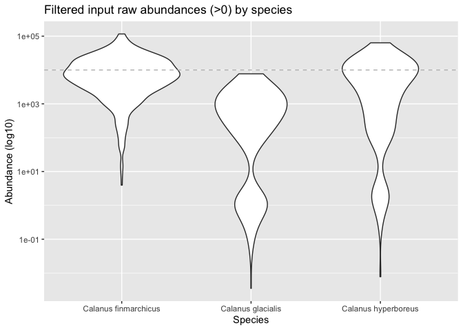
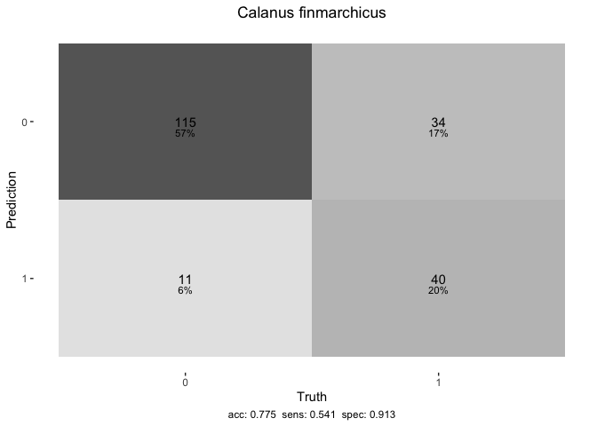

calanusthreshold
================

Provides R tools for producing threshold prey models for Calanus.

## Requirements

-   [R v4.1+](https://www.r-project.org/)

-   [rlang](https://CRAN.R-project.org/package=rlang)

-   [dplyr](https://CRAN.R-project.org/package=dplyr)

-   [readr](https://CRAN.R-project.org/package=readr)

-   [recipes](https://CRAN.R-project.org/package=recipes)

-   [rsample](https://CRAN.R-project.org/package=rsample)

-   [parsnip](https://CRAN.R-project.org/package=parsnip)

-   [yardstick](https://CRAN.R-project.org/package=yardstick)

## Installation

    remotes::install_github("BigelowLab/calanusthreshold")

**Convention**

> We prepend the package namespace to function **not** exposed by the
> `calanusthreshold` package. Bare function names (no package prepended)
> are used for base R functions and for `calanusthreshold` functions.

## The input data - observations

We provide an anonymized example dataset.

``` r
suppressPackageStartupMessages({
  library(dplyr)
  library(ggplot2)
  library(calanusthreshold)
  library(tidymodels)
})
x <- read_dataset()
dplyr::glimpse(x)
```

    ## Rows: 500
    ## Columns: 26
    ## $ year                      <dbl> 2004, 2002, 2012, 2008, 1999, 2014, 2002, 20…
    ## $ month                     <dbl> 6, 6, 11, 9, 12, 12, 10, 6, 4, 5, 11, 3, 6, …
    ## $ `Calanus finmarchicus IV` <dbl> 236.02645, 4510.13581, 1161.99465, 41.98692,…
    ## $ `Calanus finmarchicus V`  <dbl> 670.943036, 1809.590256, 8955.440010, 1894.2…
    ## $ `Calanus finmarchicus VI` <dbl> 6034.0333961, 905.4738941, -1.5132048, 204.0…
    ## $ `Calanus hyperboreus IV`  <dbl> 6483.5748842, 24903.2212951, 390.4185439, 16…
    ## $ `Calanus hyperboreus V`   <dbl> 222.1248963, 12678.9134394, 2141.9136464, 42…
    ## $ `Calanus hyperboreus VI`  <dbl> 0.69772204, 4073.72230427, 193.95381683, 1.5…
    ## $ `Calanus glacialis IV`    <dbl> 1115.7922462, 1.1160846, 192.7468295, -1.411…
    ## $ `Calanus glacialis V`     <dbl> 894.18232508, -0.11398095, 778.55885444, 0.1…
    ## $ `Calanus glacialis VI`    <dbl> 0.08948687, -0.19533522, 0.08868125, -0.0724…
    ## $ bathymetry                <dbl> -108.08097, -76.65710, -154.51820, -2671.281…
    ## $ slope                     <dbl> 0.60293689, 0.13743035, 1.72548948, 2.007829…
    ## $ aspect                    <dbl> 202.39786, 172.61117, 47.37903, 157.70372, 1…
    ## $ roughness                 <dbl> 16.281775, 3.607043, 39.982697, 46.942935, 1…
    ## $ proximity                 <dbl> 15487.692, 58168.940, 7770.374, 260893.082, …
    ## $ mlotst                    <dbl> 10.50661, 10.52630, 10.68431, 17.86722, 10.6…
    ## $ thetao                    <dbl> 10.4495645, 10.0880378, 4.2502529, 18.861244…
    ## $ usi                       <dbl> 1.809754e-05, -1.316802e-05, -5.998105e-07, …
    ## $ bottomT                   <dbl> 1.5842750, 0.4054613, 5.3369919, 2.9089500, …
    ## $ vsi                       <dbl> 2.581229e-06, -6.283402e-06, -1.378345e-05, …
    ## $ vo                        <dbl> 0.01168093, 0.02015713, -0.06217529, -0.0427…
    ## $ uo                        <dbl> 0.042651366, 0.034764852, 0.102006459, 0.063…
    ## $ so                        <dbl> 25.18974, 26.58304, 25.34187, 32.60157, 27.6…
    ## $ zos                       <dbl> -0.4254408, -0.4446317, -0.3484691, -0.49414…
    ## $ chlor_a                   <dbl> 6.440967e+00, 2.431810e+00, 2.728898e+00, -1…

If you have your own dataset just provide the filename and path, but be
sure to see `?read_dataset` dcoumentation. Note that the variables with
species names are abundance measurements by life stage.

    x <- read_dataset("/path/to/input/data.csv")

We are modeling patches of the species which we define by excess
abundance over user specified thresholds. For this example we define
just one threshold…

``` r
THRESHOLD <- 10000
```

For the purpose of illustration, we lump all stages of a given species
together.

``` r
Species <- calanusthreshold::known_species()
abund <- lapply(Species,
                        function(s) {
                          dplyr::tibble(species = s,
                            abund = calanusthreshold::lump_vars(x, vars = s,
                                                      selector = dplyr::starts_with) |>
                                    dplyr::pull("lumped"))
                        })|>
                  dplyr::bind_rows() |>
  dplyr::mutate(patch = factor(findInterval(abund, THRESHOLD),
                               levels = seq(from = 0, to = length(THRESHOLD)),
                               labels = c("sparse", THRESHOLD))) |>
  dplyr::group_by(species) |>
  dplyr::glimpse()
```

    ## Rows: 1,500
    ## Columns: 3
    ## Groups: species [3]
    ## $ species <chr> "Calanus finmarchicus", "Calanus finmarchicus", "Calanus finma…
    ## $ abund   <dbl> 6941.0029, 7225.2000, 10115.9215, 2140.3282, 23655.3459, 2179.…
    ## $ patch   <fct> sparse, sparse, 10000, sparse, 10000, sparse, sparse, sparse, …

We can plot the raw abundance by species group, note that we drop
records where abundance is less than 0 for the sake of clarity. Note
that *C glacials* generally has low patchiness when the threshold is
held high.

``` r
ggplot2::ggplot(abund %>% dplyr::filter(abund > 0), ggplot2::aes(species, abund)) + 
  ggplot2::geom_violin() + 
  ggplot2::scale_y_log10() +
  ggplot2::labs(title = "Filtered input raw abundances (>0) by species",
       x = "Species", y = "Abundance (log10)") +
  ggplot2::geom_hline(yintercept = THRESHOLD, 
             linetype = 'dashed',
             color = 'grey')
```

<!-- -->

## The model - random forest

The [tidymodels](https://www.tmwr.org/) attempts to provide a uniform
programmatic interface for myriad model functions/packages in R,
including [random forest](https://en.wikipedia.org/wiki/Random_forest)
models. The idea is to provide consistent argument interfaces, “engine”
selection, and uniform model assessment metrics.

We are going to model just `Calanus Finmarchicus`. First we prep the
dataset - dropping non-essential variables (columns), log=scaling some
variables and by aggregating (lumping) the various life-stages. The
`prep_dataset()` function includes a ‘patch’ label indicating that the
abundance for that observation exceeded the threshold. We then split the
data into a user specified proportion of training and testing groups.

``` r
x_split <- prep_dataset(x,
                        lump_var = "Calanus finmarchicus",
                        threshold = THRESHOLD) |>
 dplyr::relocate(patch, .before = 1) |>
 rsample::initial_split(prop = 0.6)
x_split
```

    ## <Analysis/Assess/Total>
    ## <300/200/500>

Next we build up a series of ‘recipe’ steps that prepare the data. The
`prep` steps implements all of the other steps, including removal highly
correlated variable (like roughness).

``` r
x_recipe <- rsample::training(x_split) |>
    recipes::recipe(patch ~.) |>
    recipes::step_corr(recipes::all_predictors()) |>
    recipes::step_center(recipes::all_predictors(), -recipes::all_outcomes()) |>
    recipes::step_scale(recipes::all_predictors(), -recipes::all_outcomes()) |>
    recipes::prep()
x_recipe
```

    ## Recipe
    ## 
    ## Inputs:
    ## 
    ##       role #variables
    ##    outcome          1
    ##  predictor         16
    ## 
    ## Training data contained 300 data points and no missing data.
    ## 
    ## Operations:
    ## 
    ## Correlation filter removed slope [trained]
    ## Centering for month, bathymetry, aspect, roughness, proximity... [trained]
    ## Scaling for month, bathymetry, aspect, roughness, proximity... [trained]

Now we can ‘bake’ the training and testing datasets.

``` r
x_testing <- x_recipe |>
    recipes::bake(rsample::testing(x_split)) 
  
  x_training <- x_recipe |>
    recipes::bake(rsample::training(x_split))
```

Now we build and fit a model. Note the we are accepting the defaults
arguments for the
[ranger::ranger()](https://www.rdocumentation.org/packages/ranger/versions/0.13.1/topics/ranger)
function.

``` r
x_model <- parsnip::rand_forest(mode = "classification") |>
      parsnip::set_engine("ranger") |>
      parsnip::fit(patch ~ ., data = x_training)
x_model
```

    ## parsnip model object
    ## 
    ## Fit time:  114ms 
    ## Ranger result
    ## 
    ## Call:
    ##  ranger::ranger(x = maybe_data_frame(x), y = y, num.threads = 1,      verbose = FALSE, seed = sample.int(10^5, 1), probability = TRUE) 
    ## 
    ## Type:                             Probability estimation 
    ## Number of trees:                  500 
    ## Sample size:                      300 
    ## Number of independent variables:  15 
    ## Mtry:                             3 
    ## Target node size:                 10 
    ## Variable importance mode:         none 
    ## Splitrule:                        gini 
    ## OOB prediction error (Brier s.):  0.1891881

## The prediction

We can now predict the outcome if we pass in another dataset, in the
case the testing data we reserved as 40% of the original. We’ll bind the
prediction to the testing data and reorganize for clarity. In the output
`patch` is out original (aka ‘Truth’) while `.pred_class` is the
predicted class (aka ‘Predicted’)

``` r
x_pred <-  predict(x_model, x_testing) |>
    dplyr::bind_cols(x_testing) |>
    dplyr::relocate(patch, .before = 1)
dplyr::glimpse(x_pred)
```

    ## Rows: 200
    ## Columns: 17
    ## $ patch       <fct> 0, 1, 0, 1, 0, 0, 1, 1, 0, 0, 0, 1, 1, 1, 0, 1, 1, 0, 0, 0…
    ## $ .pred_class <fct> 0, 1, 0, 1, 0, 1, 1, 0, 0, 0, 0, 0, 0, 0, 1, 1, 0, 0, 0, 0…
    ## $ month       <dbl> -0.5938016, 1.0931348, -0.5938016, -0.9311889, -0.5938016,…
    ## $ bathymetry  <dbl> -0.52985149, -0.16543546, -1.01676056, -0.21770387, -1.136…
    ## $ aspect      <dbl> 0.63420933, -2.95142930, -0.49349153, -0.07294458, 0.03341…
    ## $ roughness   <dbl> -0.06580198, 0.85224565, -0.62738980, -0.13441518, -0.4973…
    ## $ proximity   <dbl> -0.76641226, -0.88764152, -0.40780727, -0.35648322, -0.028…
    ## $ mlotst      <dbl> -0.66731877, -0.63769021, -0.66127137, -0.66517243, -0.660…
    ## $ thetao      <dbl> 0.48489466, -0.80637988, 0.50472807, -0.71136728, 0.480468…
    ## $ usi         <dbl> -0.03978587, -0.04614104, -0.03994837, -0.04399429, -0.047…
    ## $ bottomT     <dbl> -1.08215478, 0.49815904, -1.22295850, 1.36070073, -1.65113…
    ## $ vsi         <dbl> -0.02808831, -0.03429746, -0.03444024, -0.03114629, -0.021…
    ## $ vo          <dbl> 0.54237767, -0.50575367, 0.20304179, -0.66386630, 0.765944…
    ## $ uo          <dbl> 0.28014988, 0.88331687, -0.12154074, -1.55425681, -0.14030…
    ## $ so          <dbl> -0.67001595, -0.63660482, 0.03587577, 0.59319538, 0.096127…
    ## $ zos         <dbl> 0.25691085, 1.51196302, -0.41492897, -0.88338888, -0.41423…
    ## $ chlor_a     <dbl> 0.351305662, 0.002346937, -0.449618642, -0.952865393, -0.4…

We can compute and examine a confusion matrix.

``` r
x_cm <- yardstick::conf_mat(x_pred, patch, .pred_class)
x_cm
```

    ##           Truth
    ## Prediction   0   1
    ##          0 115  34
    ##          1  11  40

Or present graphically…

``` r
heat_map(x_cm, title = "Calanus finmarchicus")
```

<!-- -->

Similar the the ease of computing a predicted class value, we can also
produce predicted class probabilities. Here we

``` r
x_prob <-  predict(x_model, x_testing, type = "prob") |>
  dplyr::bind_cols(x_testing) |>
  dplyr::relocate(patch, .before = 1) |>
  dplyr::glimpse()
```

    ## Rows: 200
    ## Columns: 18
    ## $ patch      <fct> 0, 1, 0, 1, 0, 0, 1, 1, 0, 0, 0, 1, 1, 1, 0, 1, 1, 0, 0, 0,…
    ## $ .pred_0    <dbl> 0.9034413, 0.4457603, 0.7941833, 0.3558579, 0.7606325, 0.38…
    ## $ .pred_1    <dbl> 0.09655873, 0.55423968, 0.20581667, 0.64414206, 0.23936746,…
    ## $ month      <dbl> -0.5938016, 1.0931348, -0.5938016, -0.9311889, -0.5938016, …
    ## $ bathymetry <dbl> -0.52985149, -0.16543546, -1.01676056, -0.21770387, -1.1369…
    ## $ aspect     <dbl> 0.63420933, -2.95142930, -0.49349153, -0.07294458, 0.033411…
    ## $ roughness  <dbl> -0.06580198, 0.85224565, -0.62738980, -0.13441518, -0.49735…
    ## $ proximity  <dbl> -0.76641226, -0.88764152, -0.40780727, -0.35648322, -0.0281…
    ## $ mlotst     <dbl> -0.66731877, -0.63769021, -0.66127137, -0.66517243, -0.6609…
    ## $ thetao     <dbl> 0.48489466, -0.80637988, 0.50472807, -0.71136728, 0.4804684…
    ## $ usi        <dbl> -0.03978587, -0.04614104, -0.03994837, -0.04399429, -0.0475…
    ## $ bottomT    <dbl> -1.08215478, 0.49815904, -1.22295850, 1.36070073, -1.651135…
    ## $ vsi        <dbl> -0.02808831, -0.03429746, -0.03444024, -0.03114629, -0.0217…
    ## $ vo         <dbl> 0.54237767, -0.50575367, 0.20304179, -0.66386630, 0.7659446…
    ## $ uo         <dbl> 0.28014988, 0.88331687, -0.12154074, -1.55425681, -0.140303…
    ## $ so         <dbl> -0.67001595, -0.63660482, 0.03587577, 0.59319538, 0.0961272…
    ## $ zos        <dbl> 0.25691085, 1.51196302, -0.41492897, -0.88338888, -0.414235…
    ## $ chlor_a    <dbl> 0.351305662, 0.002346937, -0.449618642, -0.952865393, -0.47…

From the probabilities for each class we can compute ACU on the ROC.

``` r
x_auc <- yardstick::roc_auc(x_prob, patch, .pred_1, event_level = 'second') |>
  dplyr::glimpse()
```

    ## Rows: 1
    ## Columns: 3
    ## $ .metric    <chr> "roc_auc"
    ## $ .estimator <chr> "binary"
    ## $ .estimate  <dbl> 0.8117761
